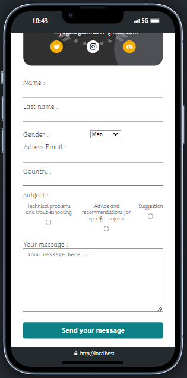

# hackers-poulette

Hackers-poulette est un projet réalisé au cours de la formation BeCode.

## Table of contents

- [Overview](#overview)
  - [The challenge](#the-challenge)
  - [Screenshot](#screenshot)
- [My process](#my-process)
  - [Built with](#built-with)
- [Author](#author)
- [Acknowledgments](#acknowledgments)

## Overview

### Le challenge

Le but de ce projet était de réaliser une page contact en PHP pour la société Hackers Poulette.
Les utilisateurs doivent être capables de : 
- envoyer un mail à la société
- recevoir un mail en retour pour confirmer la réception

Le projet devait :
- implémenter un honeypot
- Le message d'erreur doit être lisible (pour aider les utilisateurs)
- Le formulaire doit être "nettoyé" et validé (coté serveur)

### Screenshot

Desktop :

Mobile : 

## My Process

### Built with

- Semantic HTML5 markup
- Scss
- PHP
- Flexbox
- Mobile-first workflow
- PHPMailer

## Author

- Github - [Dylan Feys](https://github.com/HappyFeys/hackers-poulette)

## Acknowlegments

Merci à Ludo, Arnaud et Adrien B. pour leur temps concernant mon problème SMTP. 